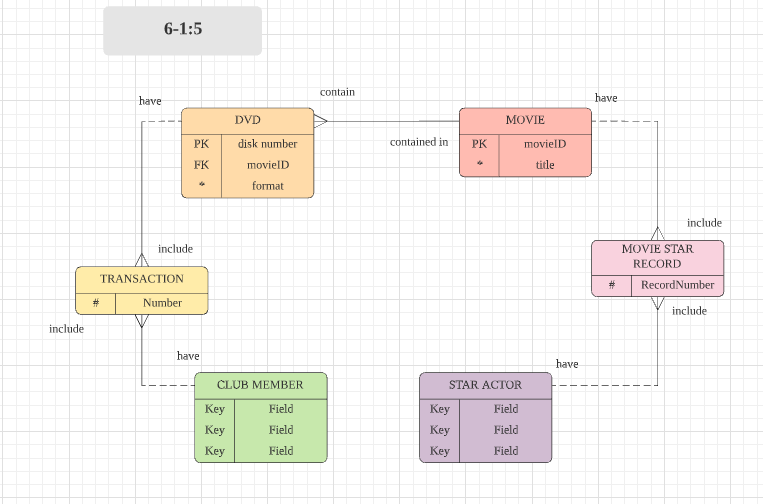

# Entity-Relationship-Diagrams
Sample of ERDs made for Database Design

## Basic ERD

As an exmaple in this ERD, let's look at the relationship between STAR_ACTOR and MOVIE_STAR_RECORD. The dotted line represents _may_ and the solid line represents _must_. Furthermore, if the line ends as a single line, it means _only one_, whereas a crow's foot represents _one or more_. 

In the direction from STAR_ACTOR to MOVIE_STAR_RECORD, the line is first dotted, and ends with a crow's foot. This means that Each STAR ACTOR _may_ have _one or more_ MOVIE_STAR_RECORDs. In the opposite direction, the line is first solid, and ends as a single line. This means that Each MOVIE_STAR_RECORD _must_ have _one and only one_ STAR_ACTOR. 

## Exclusive Relationship using an Arc

## Barred relationships

## Recursive vs Hierarchical structure

